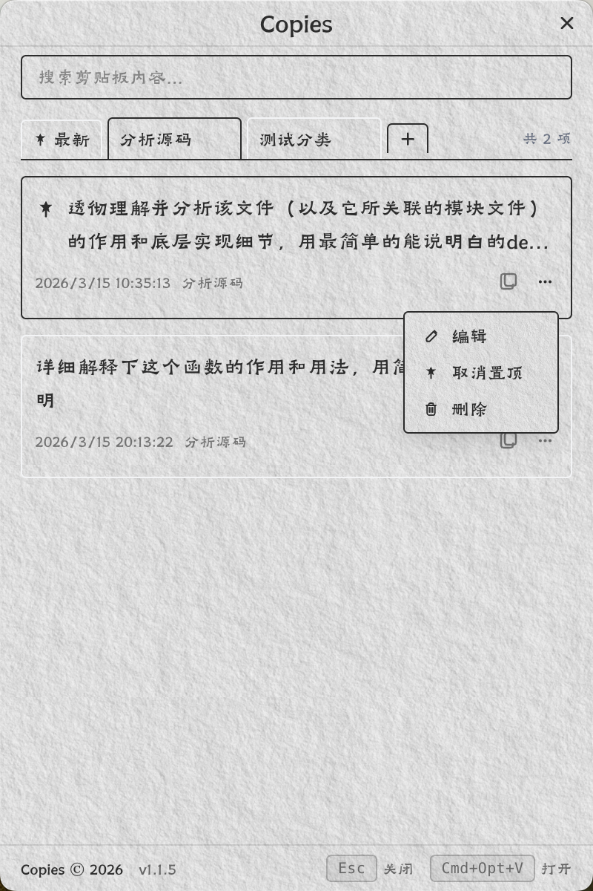

# Copies

## 智能剪贴板管理器

一款功能强大的剪贴板管理工具，帮助您高效管理和复用历史剪贴板内容。

[](https://opensource.org/licenses/MIT)
[](https://www.electronjs.org/)
[](https://react.dev/)
[](https://www.typescriptlang.org/)

## ✨ 功能特性



- **自动监听剪贴板** - 实时捕获系统剪贴板内容，自动保存历史记录
- **快捷键唤起** - 使用 `Cmd+Option+V`（Mac）或 `Ctrl+Alt+V`（Windows）**在任意位置快速打开面板**，无需切换应用
- **智能搜索** - 快速搜索历史剪贴板内容，支持关键词过滤
- **标签管理** - 支持标签的增删改查，自由创建、编辑、删除和置顶分类标签
- **内容管理** - 支持剪贴板内容的增删改查，可编辑已有内容、收藏、置顶或删除
- **跨平台支持** - 支持 macOS 和 Windows 系统
- **本地存储** - 所有数据本地存储，保护隐私安全
- **自动更新** - 内置自动更新机制，始终保持最新版本
- **系统托盘** - 最小化到系统托盘，不占用任务栏空间

## 📥 下载安装

您可以在 [GitHub Releases](https://github.com/Cslove/copies/releases) 页面下载最新版本的安装包：

- **macOS 用户** - 下载 `.dmg` 文件，打开后拖拽到 Applications 文件夹
- **Windows 用户** - 下载 `.exe` 文件，双击运行安装程序

选择与您系统对应的最新版本进行下载安装。

## 🚀 快速开始

### 环境要求

- Node.js >= 20
- npm >= 9

### 安装依赖

```bash
npm install
```

### 开发模式

```bash
npm run dev
```

### 构建应用

```bash
npm run build
```

构建完成后，安装包将输出到 `dist` 目录。

## 📦 项目结构

```text
copies/
├── electron/                 # Electron 主进程代码
│   ├── handlers/            # IPC 事件处理器
│   │   ├── clipboardHandlers.ts  # 剪贴板相关处理
│   │   ├── panelHandlers.ts      # 面板相关处理
│   │   ├── updateHandlers.ts     # 更新相关处理
│   │   └── index.ts              # 处理器注册
│   ├── managers/            # 功能管理器
│   │   ├── clipboard.ts          # 剪贴板管理
│   │   ├── hotkey.ts             # 快捷键管理
│   │   ├── panel.ts              # 面板管理
│   │   ├── tray.ts               # 系统托盘管理
│   │   └── update.ts             # 更新管理
│   ├── services/             # 服务层
│   │   └── database.ts           # 数据库服务
│   ├── utils/                # 工具函数
│   │   ├── ipcEventManager.ts    # IPC 事件管理
│   │   └── ipcProxy.ts           # IPC 代理
│   ├── main.ts               # Electron 主进程入口
│   └── preload.ts            # 预加载脚本
├── src/                     # React 渲染进程代码
│   ├── components/          # React 组件
│   │   ├── ClipboardItem.tsx    # 剪贴板条目组件
│   │   ├── EditableContent.tsx  # 可编辑内容组件
│   │   ├── EmptyState.tsx       # 空状态组件
│   │   ├── Footer.tsx           # 页脚组件
│   │   ├── Header.tsx           # 头部组件
│   │   ├── Paper.tsx            # 纸张容器组件
│   │   ├── PopoverMenu.tsx      # 弹出菜单组件
│   │   ├── Search.tsx           # 搜索组件
│   │   ├── Tabs.tsx             # 标签页组件
│   │   └── UpdateDialog.tsx     # 更新对话框组件
│   ├── hooks/                # React Hooks
│   │   ├── useAppData.ts         # 应用数据 Hook
│   │   ├── useAppHotkeys.ts      # 应用快捷键 Hook
│   │   ├── useAutoUpdate.ts      # 自动更新 Hook
│   │   ├── useClipboard.ts       # 剪贴板 Hook
│   │   ├── useClipboardActions.ts # 剪贴板操作 Hook
│   │   ├── useDatabase.ts        # 数据库 Hook
│   │   └── useHotkey.ts          # 快捷键 Hook
│   ├── stores/               # 状态管理
│   │   └── clipboardStore.ts     # 剪贴板状态存储
│   ├── utils/                # 工具函数
│   │   ├── errorHandler.ts       # 错误处理
│   │   ├── ipc.ts                # IPC 通信
│   │   ├── mockData.ts           # 模拟数据
│   │   └── platform.ts           # 平台检测
│   ├── App.tsx               # 应用主组件
│   ├── main.tsx              # React 入口
│   └── index.css             # 全局样式
├── types/                   # TypeScript 类型定义
│   ├── css.d.ts             # CSS 模块类型
│   └── index.ts             # 通用类型定义
├── .github/workflows/       # GitHub Actions 工作流
│   └── release.yml          # 自动发布工作流
├── build/                   # 构建资源
│   ├── icon.icns            # macOS 图标
│   ├── icon.png             # Windows 图标
│   └── entitlements.mac.plist # macOS 权限配置
└── package.json             # 项目配置
```

## 🛠️ 技术栈

### 核心技术

- **Electron** - 跨平台桌面应用框架
- **React 19** - UI 框架
- **TypeScript** - 类型安全的 JavaScript 超集
- **Vite** - 快速的构建工具

### 状态管理

- **Zustand** - 轻量级状态管理库

### 样式

- **Tailwind CSS 4** - 实用优先的 CSS 框架

### 工具链

- **oxlint** - 快速的 JavaScript/TypeScript linter
- **oxfmt** - 代码格式化工具
- **electron-builder** - Electron 应用打包工具

## 📝 可用脚本

| 命令 | 说明 |
| :--- | :--- |
| `npm run dev` | 启动开发服务器 |
| `npm run build` | 构建生产版本 |
| `npm run preview` | 预览生产构建 |
| `npm run format` | 格式化代码 |
| `npm run lint` | 检查代码规范 |
| `npm run lint:fix` | 自动修复代码规范问题 |
| `npm run typecheck` | TypeScript 类型检查 |

## ⌨️ 快捷键

| 快捷键 | 功能 |
| :--- | :--- |
| `Cmd+Option+V` (Mac) / `Ctrl+Alt+V` (Windows) | **在任意位置快速打开剪贴板面板**，一键复制历史内容 |

> 💡 **提示**：无论您正在使用哪个应用，只需按下快捷键即可立即唤起 Copies 面板，快速选择并复制历史剪贴板内容，无需切换窗口或中断当前工作流程。

## 🔧 配置说明

### 构建配置

应用使用 `electron-builder` 进行打包，配置位于 `package.json` 的 `build` 字段：

- **macOS**: 生成 `.dmg` 和 `.zip` 安装包
- **Windows**: 生成 `.exe` 安装包

## 📋 使用说明

### 标签管理

Copies 支持灵活的标签（分类）管理功能：

- **创建标签** - 点击标签栏右侧的 `+` 按钮，输入标签名称后按回车即可创建新标签
- **编辑标签** - 鼠标悬停在非默认标签上，点击更多菜单（三个点图标），选择"编辑"即可修改标签名称
- **删除标签** - 在标签菜单中选择"删除"，确认后将删除该标签及其下的所有内容
- **置顶标签** - 在标签菜单中选择"置顶"，重要标签将固定显示在标签栏前方
- **切换标签** - 点击不同标签可查看对应分类下的剪贴板内容

### 内容管理

对剪贴板内容的完整管理支持：

- **新增内容** - 复制任何文本内容，系统自动捕获并保存到剪贴板历史
- **编辑内容** - 点击内容区域的编辑按钮，可修改已有剪贴板内容
- **删除内容** - 通过菜单删除不需要的剪贴板记录
- **收藏内容** - 点击星标图标收藏重要内容，便于快速访问
- **置顶内容** - 置顶的内容将始终显示在列表顶部
- **复制内容** - 点击任意条目即可快速复制到剪贴板
- **移动内容** - 可将内容移动到不同的标签分类中

### 快捷键使用

快捷键是 Copies 的核心功能之一：

- **全局可用** - 无论您正在浏览网页、编写代码还是使用其他应用，快捷键始终可用
- **智能定位** - 面板会在鼠标附近位置弹出，避免遮挡视线
- **快速复制** - 打开面板后，点击任意条目即可立即复制，无需额外操作
- **自动隐藏** - 复制完成后面板自动隐藏，不干扰您的工作流程

### 自动更新

应用内置了自动更新功能，通过 GitHub Releases 进行版本分发。发布新版本时，只需推送带有版本标签的 commit：

```bash
git tag v1.1.5
git push origin v1.1.5
```

GitHub Actions 会自动构建并发布新版本。

## 🤝 贡献指南

欢迎贡献代码！请遵循以下步骤：

1. Fork 本仓库
2. 创建特性分支 (`git checkout -b feature/AmazingFeature`)
3. 提交更改 (`git commit -m 'Add some AmazingFeature'`)
4. 推送到分支 (`git push origin feature/AmazingFeature`)
5. 开启 Pull Request

## 📄 许可证

本项目采用 MIT 许可证 - 详见 [LICENSE](LICENSE) 文件

## 🙏 致谢

感谢所有为本项目做出贡献的开发者！

---

Made with ❤️ by Copies Team
